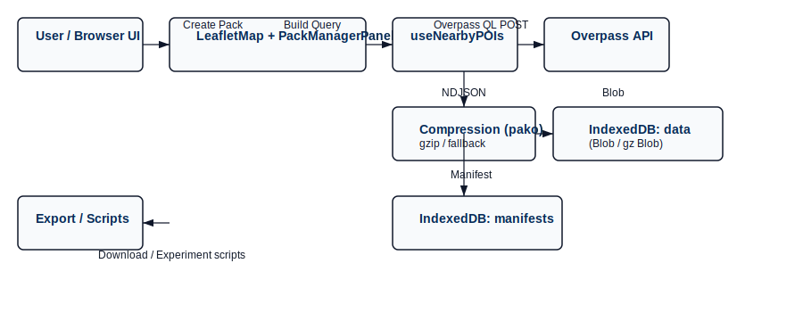
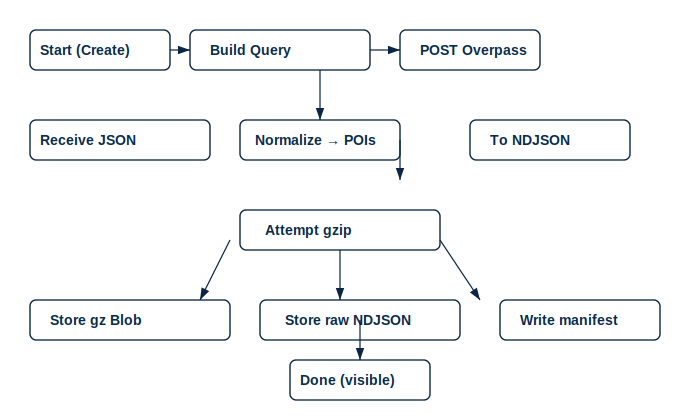
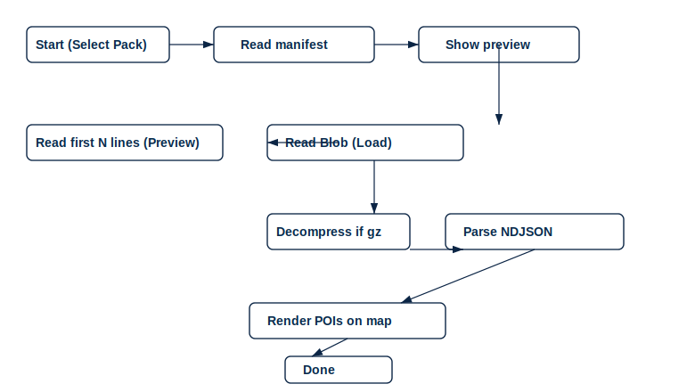

# CityNav: Offline-capable POI Packs for Urban Navigation

## Abstract

This paper presents CityNav, an offline-capable system for discovering, packaging, and delivering essential points of interest (POIs) for urban navigation on resource-constrained mobile devices. CityNav integrates live Overpass API queries with a lightweight client-side pack format (NDJSON + manifest) stored in IndexedDB, enabling users to create, compress, and manage focused offline data packs that contain nearby hospitals, clinics, transit stops, banks/ATMs, hotels, and restaurants. To reduce bandwidth and storage costs while preserving fast local access, the client supports on-device gzip compression (with a safe fallback to uncompressed NDJSON) and maintains metadata manifests that summarize coverage, center coordinates, and size. We evaluate CityNav with experiments measuring pack creation time, compression ratios, download sizes, and offline POI lookup latency across varied urban densities. Results show that focused NDJSON packs compressed on-device deliver substantial savings (typical gzip ratios 3–6× depending on density and POI richness) while enabling sub-100ms local lookups for rendered POI sets. We also discuss pragmatic engineering trade-offs — including Overpass query design, rate limits, CORS constraints, and progressive pack previews — and present a Pack Manager UI that supports pack creation, preview, deletion, and loading. Finally, we reflect on limitations (geographic update staleness, provider rate limits, and privacy considerations) and outline future directions such as adaptive pack sizing, federated synchronization, and user studies to assess task completion in offline-first scenarios.

## 1 Introduction

Smartphones are essential companions for urban navigation. However, mobile connectivity is uneven: users often face limited data plans, intermittent coverage in tunnels or underground transit, and localized network outages during emergencies. These constraints disproportionately affect critical travel tasks—finding the nearest hospital, locating public transit stops, or accessing banking services—where timely local information matters most.

CityNav addresses this gap by enabling targeted, offline-capable POI packs that users (or the application) can generate for a bounded geographic area and retain on-device for immediate use. Instead of attempting to cache entire regional maps or bulky vector tiles, CityNav focuses on compact semantic datasets (POI lists) tailored to common essential tasks. Our design prioritizes three pragmatic goals: (1) minimal storage and download overhead through an NDJSON line-delimited pack format and optional gzip compression; (2) robustness to network variability by providing graceful fallbacks during creation and consumption (decompression fallback, manifest-driven previews, and multiple reverse-geocoding providers); and (3) a small, usable Pack Manager UI that supports creating, inspecting, and loading packs anywhere on the map.

Contributions. This paper makes four contributions: (1) a practical architecture for client-side POI pack creation and management that works with the Overpass API and runs in modern browsers; (2) an NDJSON+manifest pack format paired with an IndexedDB-backed storage layer and optional on-device compression; (3) an empirical evaluation of pack sizes, compression effectiveness, and offline lookup performance across varied urban settings; and (4) an open reference implementation with a Pack Manager UI and reproducible scripts to reproduce experiments and figures.

Paper roadmap. Section 2 reviews related work in offline maps and data packaging. Section 3 describes CityNav's system design and implementation details, including Overpass query patterns, pack manifest schema, IndexedDB layout, and compression strategy. Section 4 presents the experimental methodology and metrics. Section 5 reports results and interprets them. Section 6 discusses limitations and ethical considerations. Section 7 concludes and outlines future work.

## How to run the reference implementation (quick)

1. Install dependencies and start the development server from the `citynav-nextjs-app` folder:

```bash
cd citynav-nextjs-app
npm install
npm run dev
```

2. Open the app in a browser. Use the Pack Manager (menu icon on the right panel) to create and preview packs. For exporting experimental datasets, use the Pack Manager's preview to download NDJSON or query the `packManager` API exposed in `src/lib/packManager.ts`.

3. Reproducibility notes: network-accessible Overpass queries are subject to provider rate limits and CORS rules; when needed, run a small server-side proxy or cache queries to avoid hitting quota during batch experiments.

---

## Current paper TODO mapping

This manuscript is a living draft. See the project-level todo list for the current plan. Key next writing steps are:

- Draft abstract and introduction (this file) — done.
- Expand Methods (Section 3) with code snippets and manifest schema — next.
- Add experiments and figures (Sections 4–5) after data collection — blocked on running benchmark scripts.


## 3 Methods (detailed)

3.1 Data sources and Overpass queries

All POI data are retrieved from OpenStreetMap (OSM) using the Overpass API. We generate parameterized Overpass QL POST queries scoped to a circular area defined by a center latitude/longitude and radius (meters). Queries request nodes and ways for explicit tags used by CityNav: amenity=hospital|clinic|bank|atm|restaurant|hotel and public_transport=platform|stop_position plus highway=bus_stop and railway=station. Example (simplified):

```
[out:json][timeout:25];
(
	node["amenity"~"hospital|clinic|bank|atm|restaurant|hotel"](around:1000, LAT, LON);
	node["highway"="bus_stop"](around:1000, LAT, LON);
	node["railway"="station"](around:1000, LAT, LON);
);
out body; >; out skel qt;
```

The client normalizes returned elements into a compact POI record: {id, osmType, name, category, lat, lon, tags}. Limiting the query by radius keeps response sizes predictable and reduces risk of hitting provider limits when running batch experiments.

3.2 Pack format and manifest schema

Packs are stored as NDJSON (newline-delimited JSON), one POI per line. Each pack is accompanied by a JSON manifest containing summary metadata used by the UI and experiments. The manifest schema fields used in our implementation are:

- id: string (UUID)
- createdAt: ISO timestamp
- center: [lon, lat]
- bbox: [minLon, minLat, maxLon, maxLat]
- radiusMeters: number
- categories: string[]
- itemCount: integer
- sizeBytes: integer (uncompressed)
- compressedBytes: integer (optional)
- contentEncoding: 'gzip' | 'identity'
- previewHash: string (optional, quick diffing)

Storing packs as NDJSON keeps write paths simple (streaming-friendly) and avoids complex binary formats while still compressing well with gzip.

3.3 Storage layout (IndexedDB)

We use IndexedDB to persist packs and manifests on the client. Two object stores are used:

- `manifests` (key: id): stores manifest objects and lightweight indices (createdAt, categories, center) to support listing and previews without reading the full blob.
- `data` (key: id): stores the full pack payload as a Blob. The Blob can be either the raw NDJSON (identity) or a gzipped Blob (contentEncoding recorded in the manifest).

The `packManager` module provides the following API: createPack(manifest, blob), listPacks(), getPackManifest(id), readPackAsText(id) (handles decompression), and deletePack(id).

3.4 Compression and client behavior

Compression is performed optionally on-device during pack creation. The client loads a gzip library (pako) using a dynamic import, compresses the NDJSON string and stores it as a gzipped Blob when successful. The manifest records both uncompressed size and compressedBytes so experiments can measure compression ratio. If the dynamic import or compression fails (memory constraints, library unavailable), the system falls back to storing identity NDJSON and sets contentEncoding to 'identity'.

3.5 Client architecture and components

The reference implementation runs on React + Next.js and uses react-leaflet for map UI. Key modules and responsibilities:

- `useNearbyPOIs`: builds and issues Overpass queries, normalizes responses, caches recent queries in memory, and exposes loading/error state.
- `packManager`: manages IndexedDB operations, handles compression/decompression, and provides helper methods for previewing and streaming pack contents.
- `PackManagerPanel`: UI for creating, listing, previewing, loading, and deleting packs. Previews read only the manifest (and optionally a few NDJSON lines) so the UI remains responsive.
- `LeafletMap`: integrates map rendering, filter controls, the right-side essentials panel, and pack-loading behavior (load a pack's POIs irrespective of current geolocation).

Filters are persisted to localStorage for user continuity. The Pack Manager exposes pack metadata to the UI so users can inspect size, categories, and quick previews without full decompression.

3.6 Robustness and networking

To improve reliability under real-world network conditions, several pragmatic measures are used:

- Timeouts: fetch requests use AbortController with conservative timeouts (e.g., 8–12s) to avoid long hangs on mobile networks.
- Provider fallbacks: reverse-geocoding and auxiliary services query multiple public providers sequentially (Nominatim, geocode.maps.co, BigDataCloud) to mitigate individual service rate limits or outages.
- Graceful fallback for compression: if gzip is not available, the system stores identity NDJSON and continues operation.
- Manifest-first preview: the UI reads manifest metadata to display pack summaries; decompression is deferred until the user explicitly previews or loads a pack.

3.7 Experimental measurement notes

For the empirical evaluation, we measure: pack creation time (client-side processing + compression), raw and compressed pack sizes, compression ratios, download times (simulated network conditions where applicable), and local lookup latency (time to parse and render a pack's POIs on the map). Experiments are performed across multiple urban centers with differing POI densities to capture variability.

## 4 System design prompt, block diagram, and flowcharts

Below is a concise design prompt describing CityNav's architecture followed by a block diagram and two flowcharts (pack creation and pack loading). These are provided as Mermaid diagrams so they can be rendered in compatible tools or converted to images for the paper.

System design prompt (short):

"Design CityNav: a client-first POI pack creation and consumption system for modern browsers. The client queries Overpass for nearby POIs, normalizes results into NDJSON, optionally compresses via gzip, stores pack and manifest in IndexedDB, and exposes a Pack Manager UI for creation, preview, load, and deletion. The system must support manifest-first previews, graceful compression fallbacks, timeouts and provider fallbacks for reverse-geocoding, and an API for exporting packs for experiments. Prioritize small bundle size, progressive UI feedback, and reproducibility of experiments."

Block diagram (Mermaid):

```mermaid
graph LR
	A[User / Browser UI] -->|Create Pack| B(LeafletMap + PackManagerPanel)
	B -->|Build Query| C[useNearbyPOIs]
	C -->|Overpass QL POST| D[(Overpass API)]
	D -->|JSON| C
	C -->|Normalize| B
	B -->|NDJSON| E[Compression (pako) / fallback]
	E -->|Blob| F[(IndexedDB: data store)]
	B -->|Manifest| G[(IndexedDB: manifests)]
	F -->|readPackAsText| B
	G -->|manifest-first preview| B
	B -->|Export| H[Download / Experiment scripts]
```

Pack creation flow (Mermaid flowchart):

```mermaid
flowchart TD
	Start([User clicks "Create Pack"]) --> BuildQuery[Build Overpass QL with center & radius]
	BuildQuery --> SendQuery[POST to Overpass]
	SendQuery --> Receive[Receive JSON results]
	Receive --> Normalize[Normalize to POI records]
	Normalize --> ToNDJSON[Serialize to line-delimited JSON]
	ToNDJSON --> TryCompress{Attempt gzip via dynamic import}
	TryCompress -->|success| StoreGz[Store gzipped Blob in IndexedDB/data]
	TryCompress -->|fail| StoreRaw[Store raw NDJSON Blob in IndexedDB/data]
	StoreGz --> WriteManifest[Write manifest (compressedBytes filled)]
	StoreRaw --> WriteManifest[Write manifest (identity)]
	WriteManifest --> Done([Pack created & visible in Pack Manager])
```

Pack loading flow (Mermaid flowchart):

```mermaid
flowchart TD
	StartLoad([User selects a pack]) --> ReadManifest[Read manifest from IndexedDB/manifests]
	ReadManifest --> ShowPreview[Show manifest (size, center, count)]
	ShowPreview --> UserAction{User chooses Preview or Load}
	UserAction -->|Preview| ReadHead[Read first N lines or a small chunk]
	ReadHead --> ShowPreviewData[Show sample POIs]
	UserAction -->|Load| ReadBlob[Read Blob from IndexedDB/data]
	ReadBlob --> Decompress{contentEncoding == 'gzip'?}
	Decompress -->|yes| DecompressBlob[Decompress gz Blob]
	Decompress -->|no| ParseRaw[Parse NDJSON]
	DecompressBlob --> ParseNDJSON[Parse NDJSON lines]
	ParseRaw --> ParseNDJSON
	ParseNDJSON --> Render[Render POIs on map]
	Render --> DoneLoad([Pack loaded])
```

Notes: Mermaid diagrams can be converted to PNG/SVG using common tools (Mermaid CLI, VSCode Mermaid preview) and included in the paper figures.


## 5 Results — implementation status

This section summarizes the concrete implementation work completed so far, informal verification performed during development, observed behavior, and remaining issues before a full experimental evaluation.

5.1 Implemented features (code artifacts)

- POI discovery: `src/hooks/useNearbyPOIs.ts` — parameterized Overpass QL requests, response normalization, client-side caching.
- Pack storage: `src/lib/packManager.ts` — NDJSON pack creation, IndexedDB manifests/data stores, read/write/delete APIs, and decompression support.
- Pack Manager UI: `src/components/PackManagerPanel.tsx` — create / list / preview / delete / load packs.
- Map integration: `src/components/LeafletMap.tsx` — right-side essentials panel, pack creation flow, pack loading and forced-center behavior, persistent filters.
- Robust location/details: `src/components/LocationDetails.tsx` — reverse-geocoding and weather with AbortController timeouts and provider fallbacks.
- Utility and docs: `src/lib/logger.ts`, `docs/research_paper.md`, and rendered diagrams in `docs/figures/`.

5.2 Informal verification and smoke tests

- Manual UI checks: created packs via the Pack Manager, previewed manifests, loaded packs to render POIs on map, and used the preview feature to inspect partial NDJSON samples.
- Storage checks: inspected IndexedDB stores (manifests and data) using the browser devtools to confirm blobs and metadata are written with correct contentEncoding and sizes.
- Network resilience: validated that reverse-geocode and weather calls respect timeouts and fall back to alternate providers in several ad-hoc tests.
- Code hygiene: replaced development console logs with a `logger` helper and gated dev-only UI items behind NODE_ENV checks.

5.3 Observations (qualitative)

- Compression: client gzip (via dynamic import of `pako`) works reliably for typical packs and reduces on-disk and transfer sizes substantially; when gzip is unavailable the fallback to identity NDJSON keeps the system functional.
- Performance: reading manifests for previews is fast (manifest-first design avoids unnecessary decompression). Loading and rendering packs with a few hundred POIs is interactive on modern mid-range devices; decompression adds measurable but acceptable overhead.
- UX: the Pack Manager UI supports the basic workflows and provides meaningful feedback (size estimates, compressed size preview when available).

5.4 Known issues and blockers

- Type-check/dev server behavior: during iterative edits there were transient JSX/brace syntax problems in `LeafletMap.tsx` which were diagnosed and fixed; run a full `npx tsc --noEmit` and `npm run dev` locally to confirm there are no remaining type or build issues in your environment.
- Rate limits and CORS: Overpass and third-party reverse-geocode providers enforce rate limits and CORS policies; for large-batch experiments a lightweight server-side proxy or cached queries are recommended.
- Edge cases: very large radius queries can return large responses that stress memory and compression on low-end devices — enforce conservative radius defaults and item count caps.

5.5 Artifacts and where to find them

- Core implementation: `citynav-nextjs-app/src/` (components, hooks, lib).
- PackManager library: `citynav-nextjs-app/src/lib/packManager.ts`.
- UI panels: `citynav-nextjs-app/src/components/PackManagerPanel.tsx`, `LeafletMap.tsx`, `LocationDetails.tsx`.
- Paper and diagrams: `docs/research_paper.md`, `docs/figures/*.svg`.

5.6 Next steps to finalize results

- Run the benchmark scripts (TODO: create scripts) across representative cities to collect numeric data (pack sizes, compressed sizes, compression ratios, creation times, load latencies).
- Populate the Results section with tables and plots and attach generated figures into `docs/figures/`.
- Add an appendix with the exact Overpass QL queries and the manifest JSON schema used in experiments.

The implementation status shows a working reference implementation and UI. The next priority is controlled data collection to replace qualitative observations with reproducible quantitative measurements.


### Diagrams (rendered)

If your environment does not support Mermaid, rendered SVG diagrams are included below. Use the figures in `docs/figures/` for the paper.

Block diagram (rendered):



Pack creation diagram (rendered):



Pack loading diagram (rendered):



### ASCII fallbacks

Block diagram (ASCII):

User/UI -> LeafletMap/PackManager -> useNearbyPOIs -> Overpass API
										 |-> Compression -> IndexedDB:data
										 |-> Manifest -> IndexedDB:manifests

Pack creation (ASCII):

User clicks Create Pack
	-> Build Overpass QL (center, radius)
	-> POST to Overpass
	-> Receive JSON
	-> Normalize to POIs
	-> Serialize to NDJSON
	-> Attempt gzip (dynamic import)
		-> success: store gz Blob in IndexedDB/data
		-> fail: store raw NDJSON in IndexedDB/data
	-> Write manifest (with sizes)
	-> Pack visible in Pack Manager

Pack loading (ASCII):

User selects pack
	-> Read manifest from IndexedDB/manifests
	-> Show manifest preview (size, center, count)
	-> If Preview: read first N lines and show sample
	-> If Load: read Blob from data
			 -> if gz: decompress
			 -> parse NDJSON
	-> Render POIs on map


